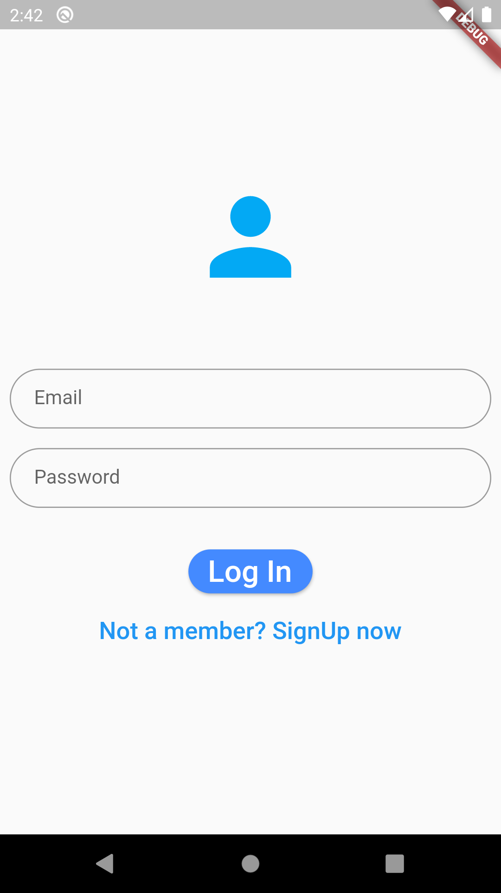
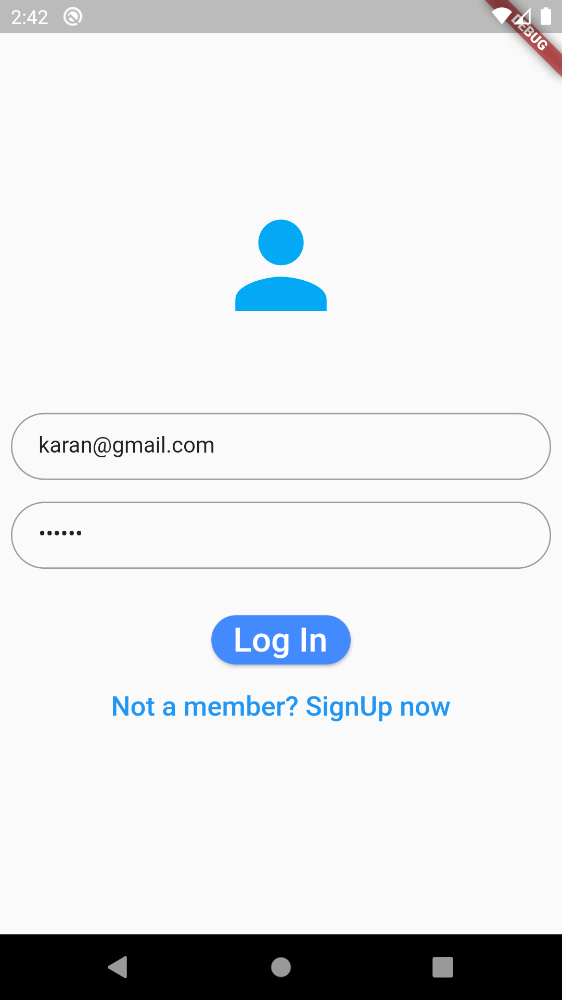
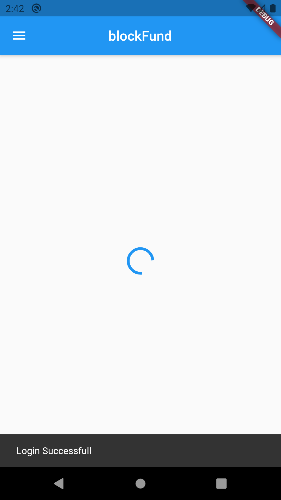
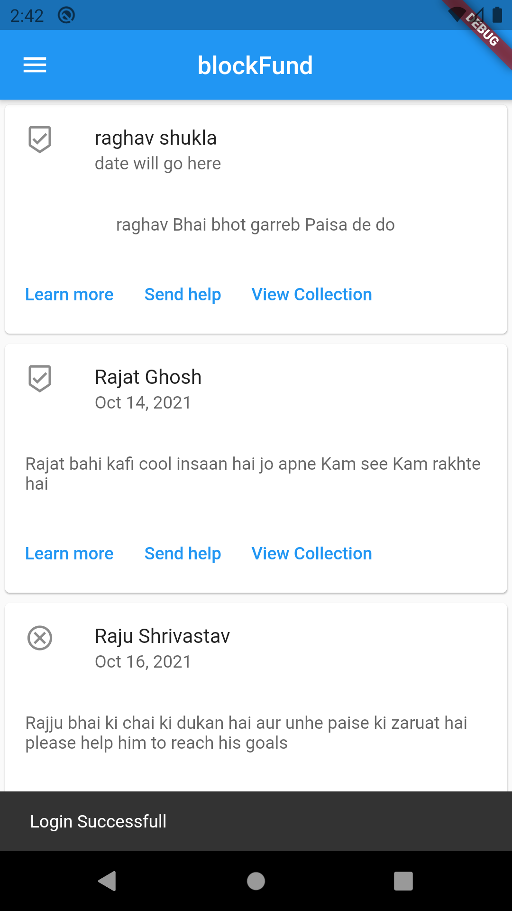
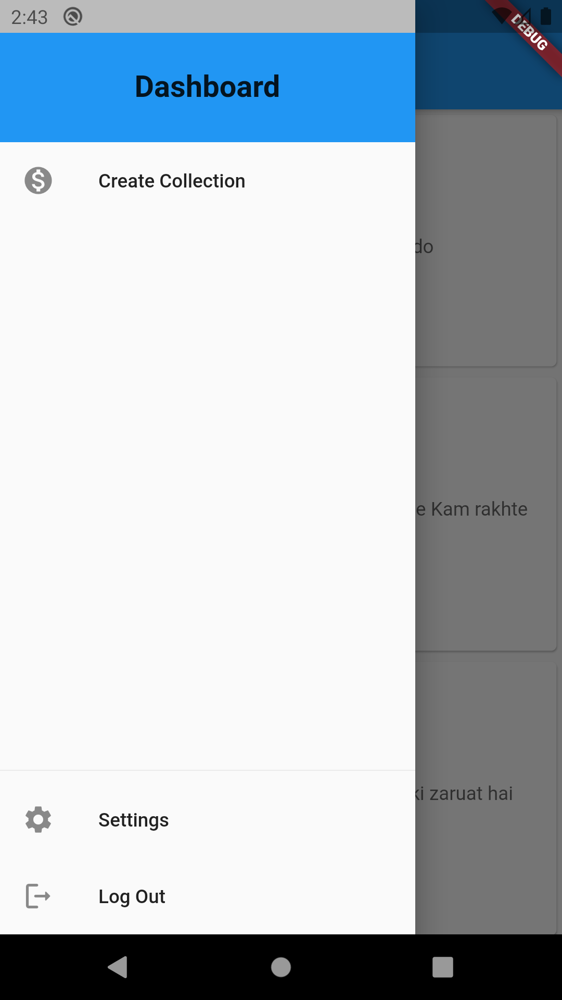
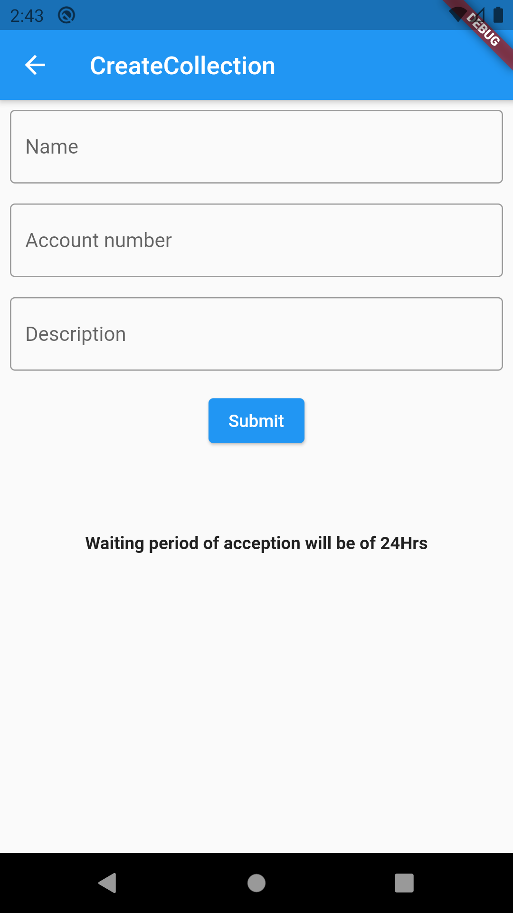

# blockFund - A way to donate

blockFund is a fundraiser Dapp which uses blockchain technolodgy created with flutter , firebase , solidity , web3dart and infura.io.

It uses Ethereum smart contract written in solidity as a base and communiates with it using web3.

A user can create his/her own account which is stored on firebase's authentication.

|  |  |  |

which then sends them to the home screen or feed which is fetched form the firebase realtime storage for fast retrival of data.

view collection sends them to the view collection screen which fetches data form the contracts as an array of tuples
which is then destructured into list tiles which shows amount and senders account information.

|  | |  | |  |

On the drawer they can add a new collection which will later shown on the feed after the complete checking of resources provided.
user can also log out from here.

- create collection will send them to the createcollection screen which is linked with firebase storge to store information about the reciever.
- learn more sends them to the information page.
- send help sends them to the payment page which is connected to the block chain and can later be connected to payment gateway using gateway sdks.
